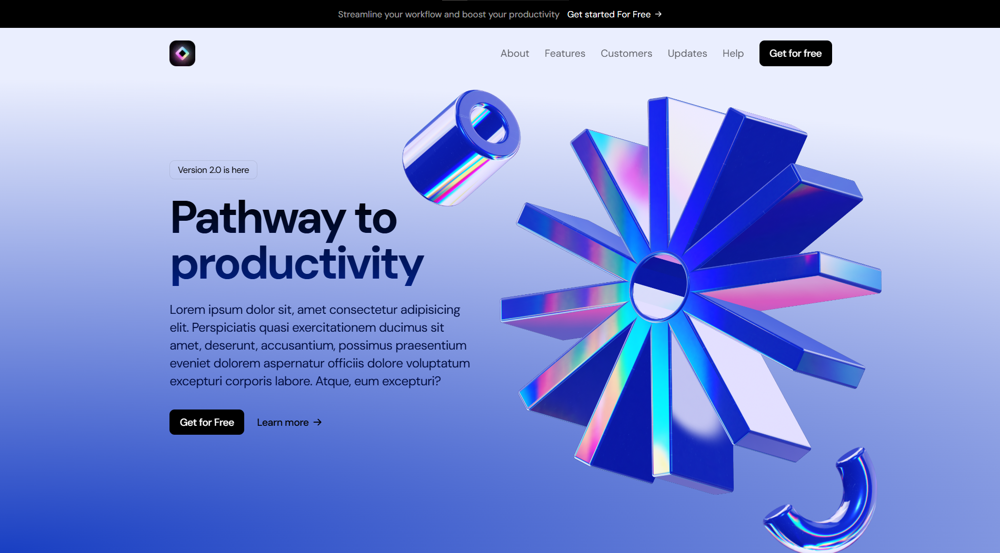

# Magic AI - SaaS Landing Page

A clean and modern landing page template built with Next.js. This project is designed to showcase SaaS applications and can be customized to fit other types of landing pages.

**Live Demo**: [Magic AI](https://magic-ai-2v2v.vercel.app/)

## Table of Contents

- [Features](#features)
- [Screenshots](#screenshots)
- [Tech Stack](#tech-stack)
- [Installation](#installation)
- [Usage](#usage)
- [Deployment](#deployment)
- [Contributing](#contributing)
- [License](#license)

## Features

- Fully responsive and optimized for all screen sizes
- SEO-friendly with metadata configuration
- Customizable design with Tailwind CSS
- Google Fonts integration for custom typography
- Optimized for high performance with static generation

## Screenshots



## Tech Stack

- **Framework**: Next.js
- **Styling**: Tailwind CSS
- **Fonts**: Google Fonts (DM Sans)

## Installation

1. **Clone the repository:**

   ```bash
   git clone https://github.com/yourusername/magic-ai.git
   cd magic-ai
   ```

2. **Install dependencies:**
   ```bash
   npm install
   ```

## Usage

To run the project locally:

```bash
npm run dev
```

Open your browser and navigate to `http://localhost:3000`.

## Deployment

This project is designed to be easily deployable on platforms like [Vercel](https://vercel.com/).

1. Push your repository to GitHub.
2. Link your GitHub repository to Vercel.
3. Set up any necessary environment variables in the Vercel dashboard.
4. Deploy with one click.

## Contributing

Contributions are welcome! If you'd like to improve or customize the project, feel free to submit a pull request. Please follow the [contribution guidelines](CONTRIBUTING.md) before submitting your code.

## License

This project is licensed under the MIT License - see the [LICENSE](LICENSE.txt) file for details.
